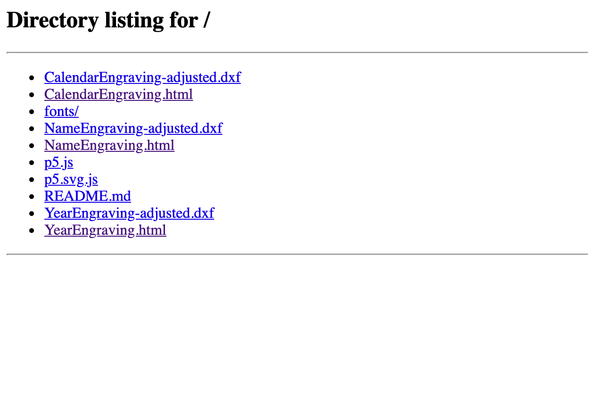

## To Edit:

This folder contains three html files:

- [YearEngraving.html](YearEngraving.html)
- [CalendarEngraving.html](CalendarEngraving.html)
- [NameEngraving.html](NameEngraving.html)

Open each html file in this folder in a source-code editor (I recommend [VSCode](https://code.visualstudio.com/)) and you will see 

## To Run Edited Files:

Navigate to this folder in the terminal and run:

`python -m SimpleHTTPServer`

Then open a web browser (I'm using Chrome) and go to:

`http://localhost:8000/`

If you don't have python installed on your machine, install node:

https://nodejs.org/en/

Then install http-server by typing the following into the terminal:

`npm install -g http-server`

After it is installed, navigate to this folder in the terminal and type:

`http-server -p 8000`

When you go to `http://localhost:8000/`, you will see links to several html files:

Click on each html link and you will see the generated design and the page will immediately save a copy of the design as an svg.

