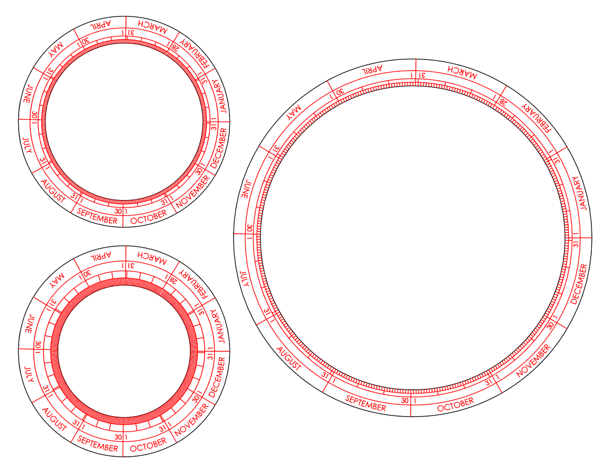
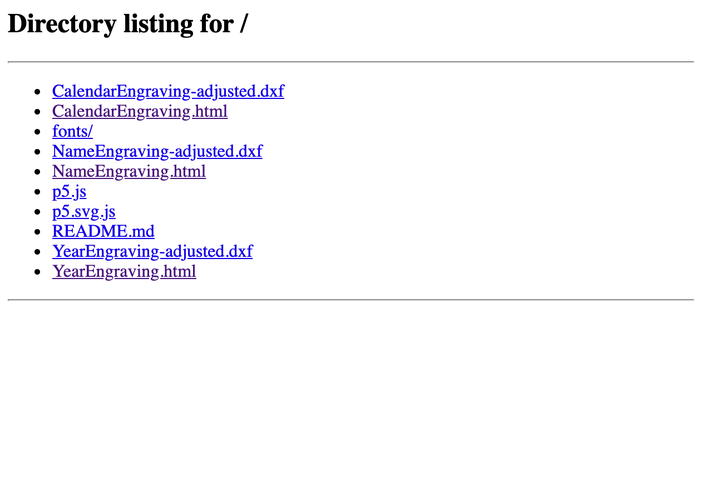
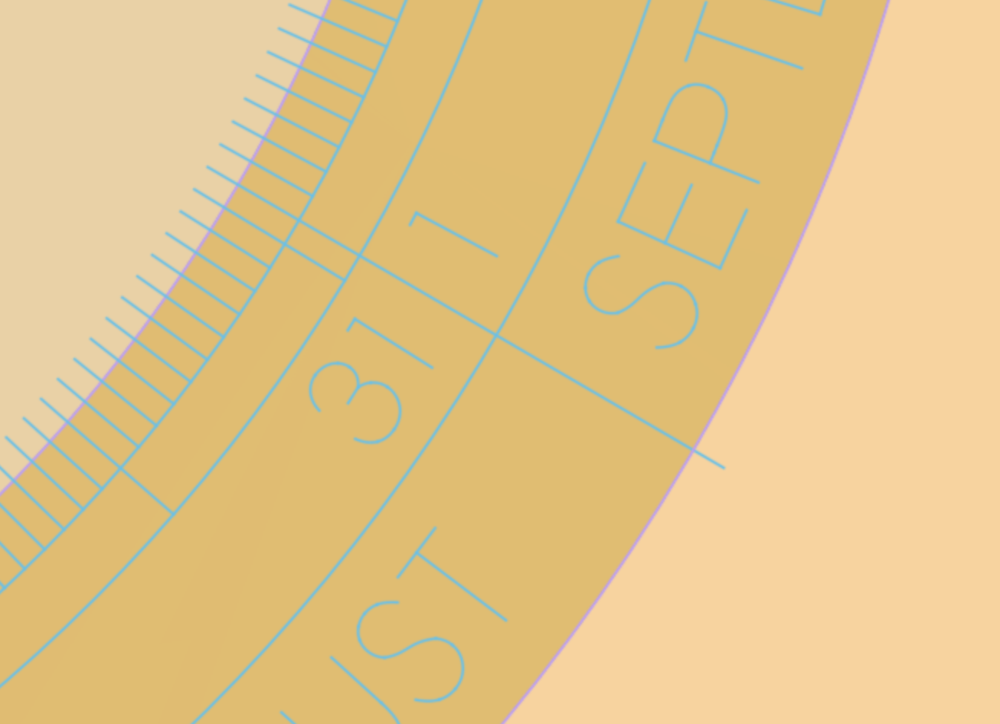
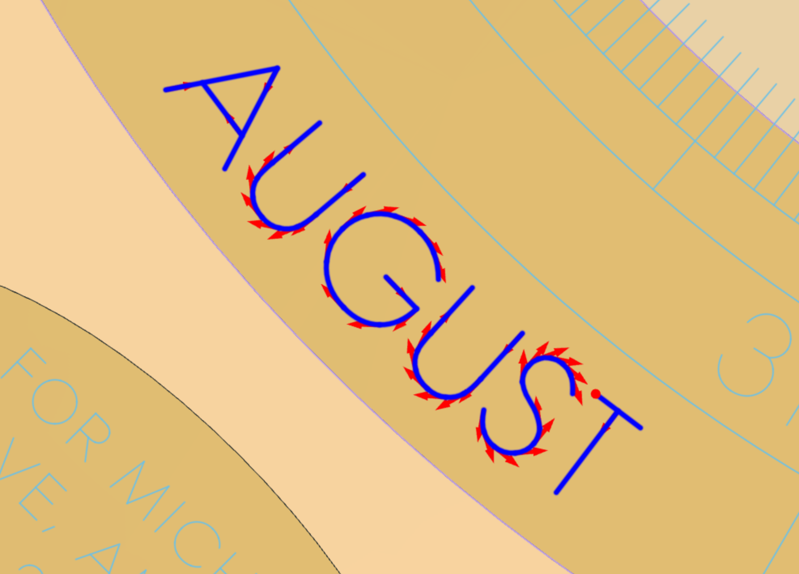
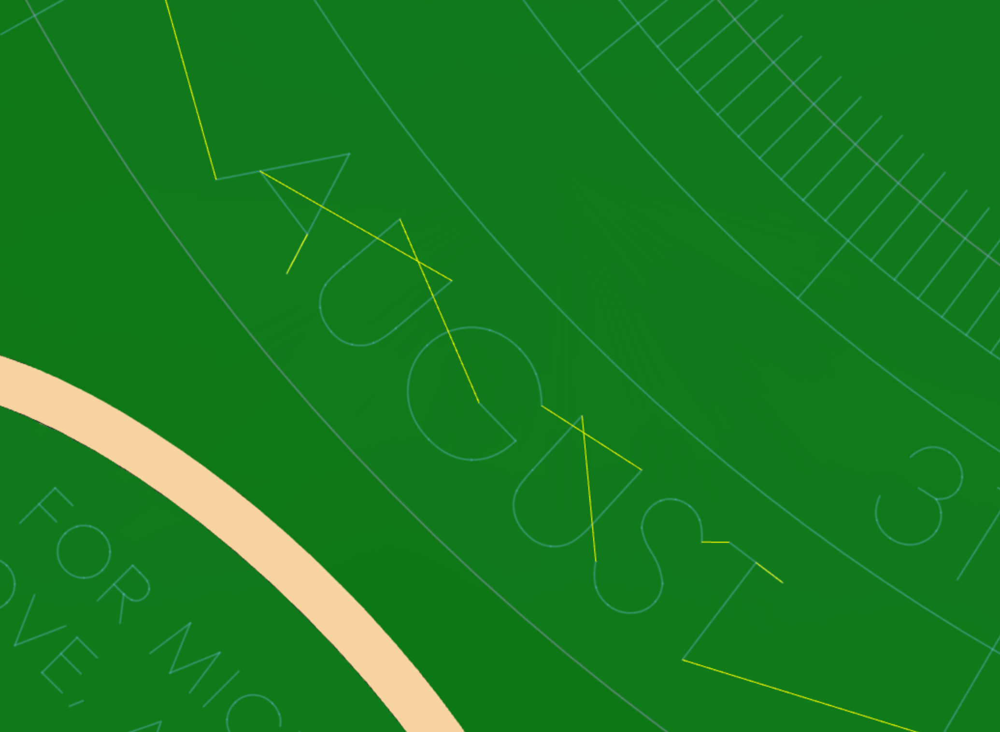
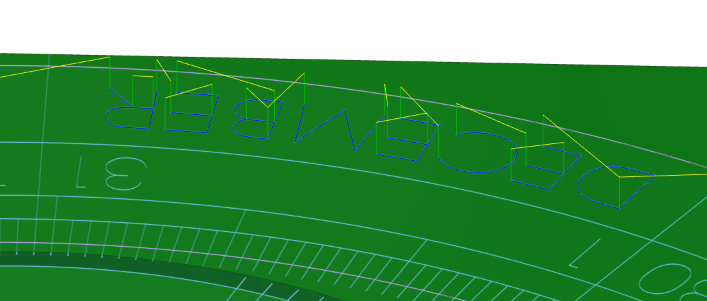
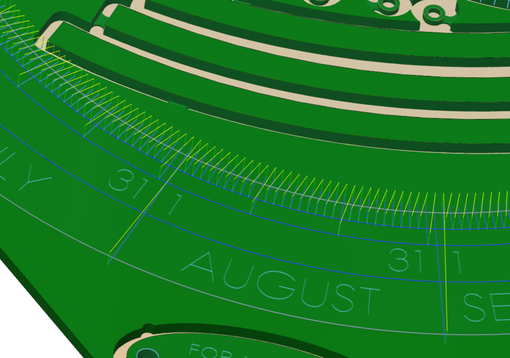

# Engraving Design and Toolpathing

The engravings for the orrery were fairly complicated, so I've designed them parametrically using [P5.js](https://p5js.org/).  The scripts to generate the designs are currently hosted at the following links:

- [Calendar Engraving](https://apps.amandaghassaei.com/tellurion-orrery/engravings/CalendarEngraving.html)
- [Year Engraving](https://apps.amandaghassaei.com/tellurion-orrery/engravings/YearEngraving.html)
- [Name Engraving](https://apps.amandaghassaei.com/tellurion-orrery/engravings/NameEngraving.html)

By working parametrically, you change high level parameters in the design (like the overall dimensions, spacing of characters, length of tick marks) and generate a new layout immediately.  Here are some possible variations on my calendar design:

The SVGs generated by my scripts will need to be converted into DXF before importing into Fusion (I did this in Illustrator).  All the DXFs included in this folder are in units of inches.

## Fonts

Currently, all scripts use the [Century Gothic](fonts/CenturyGothic.ttf) font, but you can try out the other fonts included in the [fonts](fonts/) folder, or try out your own.  I like Century Gothic for this project because it uses circles to form many of the letters, which mirrors the circular shape of the orrery overall.  Century Gothic has a thin stroke, but it is not a [single line font](http://imajeenyus.com/computer/20150110_single_line_fonts/index.shtml), so I had to edit it to make it work as an engraving font:

>A single line font is a typeface that uses one line to define the shape of each letter, or glyph. Conventional fonts utilize two lines, an inner and outer pair of lines, that define the shape and thickness of the letterforms.

The `XXX-adjusted.dxf` files in this folder show the changes I made to the font before I brought it into Fusion – once in Fusion, I added more lines to complete the letters (this was easier to do in Fusion than Illustrator because I could more easily snap to the midpoints of lines).  A single line font would not require so much editing, but I was happier with the quality of the line that I got from Century Gothic.

To give you an idea, here is what I got from [Hershey Font](https://observablehq.com/@jonsadka/hershey-vector-font-explorer) (a popular single line font):

compared to Century Gothic:

There's a big difference in the quality of the curved lines (compare the `R`, `B`, and `C`).

## To Edit:

This folder contains three html files:

- [YearEngraving.html](YearEngraving.html)
- [CalendarEngraving.html](CalendarEngraving.html)
- [NameEngraving.html](NameEngraving.html)

Open each html file in this folder in a source-code editor (I recommend [VSCode](https://code.visualstudio.com/)) and you will see the javascript code used to generate each design.  Hopefully the comments in there are enough to guide you.

## To Run Edited Files:

After you've edited the files, you can run them by creating a local html server on your computer.

Navigate to this folder in the terminal and run:

`python -m SimpleHTTPServer`

Then open a web browser (I'm using Chrome) and go to:

`http://localhost:8000/`

If you don't have python installed on your machine, install node:

https://nodejs.org/en/

Then install http-server by typing the following into the terminal:

`npm install -g http-server`

After it is installed, navigate to this folder in the terminal and type:

`http-server -p 8000`

When you go to `http://localhost:8000/`, you will see links to several html files:

Click on each html link and you will see your edited design drawn on the screen and the page will immediately save a copy of the design as an svg.

## Notes on Toolpathing Engravings:

The most deflection you'll get in an engraving cut happens where the tool enters the material.  Exiting the material can also leave a nonuniform surface finish.  Where possible I've extended paths to run outside the boundary of the workpiece for a better finish (these are called lead-ins and lead-outs):

In general, you should try to minimize the number of times you enter and exit the material while you're cutting the workpiece.  So when cutting continuous paths made from several discrete line segments, be sure to select the segments in the correct order so that you generate a continuous toolpath.

These curved paths are made from several discrete line segments that must be individually selected:

They have been selected in order so that they are engraved in a continuous toolpath:

When selecting paths for engraving, you will get a more consistent result if you trace identical characters or shapes in the same direction each time.  So if you have several of the character `T` in your design, pick a direction to traverse the contours of the `T` and be consistent across the toolpath.  Similarly, all tickmarks should be traversed in the same direction.

See how the `E` character is traversed in the same way in this toolpath:

These tick marks are also traversed in a consistent direction:

