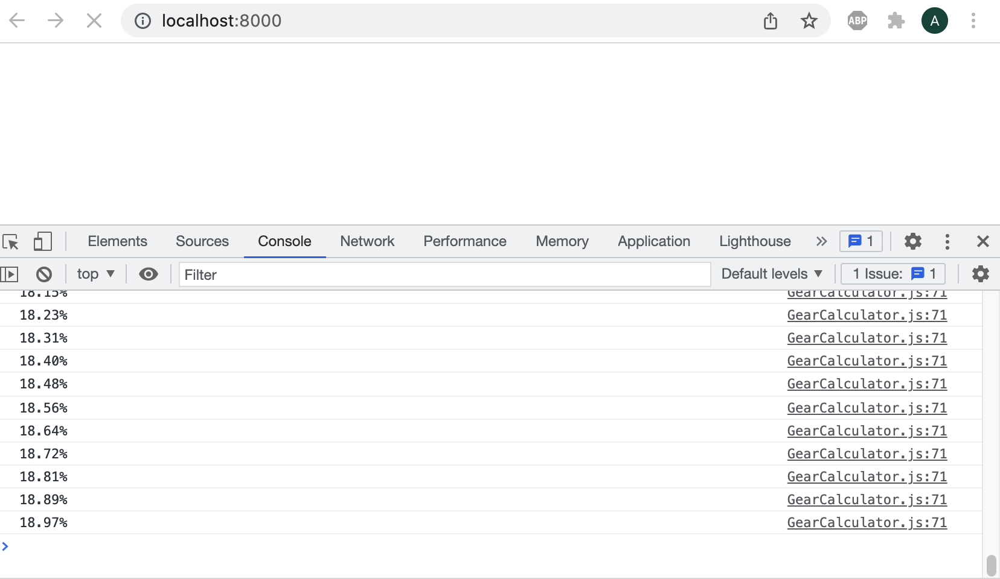

# Gear Calculations

The orrery design consists of 4 interconnected gear trains that control the relative motions of the earth, moon, and sun, and a fifth gear train that ticks forward a dial marking 100 years.

In addition to accurately positioning various components of the orrery, the gears must be sized so that they fit coaxially on five vertical axles:

My code for calculating the gear ratios was done quickly without much thought for reuse – but I've added some notes here to explain the process.  

I've saved all the information I used during these calculations to a [Google Doc](https://docs.google.com/spreadsheets/d/1HO8HQtnuJBg7-cl2iLWuv1kIT8sFUn2m3BNM2MRiHnA/edit?usp=sharing) and I've backed up all the data in the [results](results) folder.  The first tab shows the astronomical parameters I was trying to model and their frequency.  Highlighted in blue are the gear parameters I used in v1 of my design, and highlighted in magenta are parameters used in v2 of my design.  The magenta and blue colors are continued across the other tabs in the sheet, where you can see more gear ratio options I was considering.

All the gear generation code was written in javascript and is included in this folder. I really liked this online [Gear Train app](http://scientific601.altervista.org/gear/gearcalc.html) and used it as a starting point as I began to design my gear trains, but found that I needed to calculate a large set of candidate gear trains for a given target ratio instead of just the single most optimal configuration. The file [GearCalculator.js](https://github.com/amandaghassaei/tellurion-orrery/blob/main/gear-calculations/GearCalculator.js) contains a function `calcGearTrain` that performs an exhaustive search to find set of gears meeting min tooth, max tooth, number of stages, and maximum error requirements (it takes about five minutes to complete for the three stage gear trains I'm looking at). The solutions (`hits`) are printed as a tsv to the console, so they can easily be copied and pasted into a spreadsheet.

### Moon Orbit

First I used GearCalculator.js to calculate optimal solutions for a 3 stage gear train to drive the rotation of the moon around the earth. I chose a minimum tooth number of 8 and a maximum of 55. My code found the same optimal ratios as the online gear train app, but also gave me many alternatives that were slightly less optimal from an error perspective, but may satisfy other geometric properties of interest. I saved all permutations of each of these `hits` to a global variable called `options` in the file [ImportOptions.js](https://github.com/amandaghassaei/tellurion-orrery/blob/main/gear-calculations/ImportOptions.js).

[CalcFit.js](https://github.com/amandaghassaei/tellurion-orrery/blob/main/gear-calculations/CalcFit.js) uses the information stored in `options` to assess the options in terms of geometric constraints. Since I made my parts using a CNC machine, I allowed for a small amount of scaling of the tooth pitch to help open up the available gear options, but I didn't want the difference in tooth scale to be too noticeable

### Ecliptic

CalcFit.js first determines the amount of scaling needed by the third stage of the moon orbit train to make it coaxial with the mirrored ecliptic train.

### Moon Nodes

I wanted to drive one of the remaining gear trains (either the moon's perigee or nodes) from a single stage off the fourth axle in my five axle setup, so I calculated optimal single stage trains for driving either the perigee or the nodes and printed this as a single tsv (pasted [here](https://docs.google.com/spreadsheets/d/1HO8HQtnuJBg7-cl2iLWuv1kIT8sFUn2m3BNM2MRiHnA/edit#gid=189566112) – `Gear Ratios (Moon Orbit)` tab, you have to scroll way to the right to see the perigee and nodes calculations). I found a few good options for a single stage to drive the nodes (highlighted in blue and magenta ended up using these), and another for a single stage to drive the perigee (highlighted in orange).

### Moon Perigee

Next I used GearCalculator.js to calculate a set of optimal 2 stage trains to be driven off the third axle of the moon orbit train. I pasted the resulting tsv [here](https://docs.google.com/spreadsheets/d/1HO8HQtnuJBg7-cl2iLWuv1kIT8sFUn2m3BNM2MRiHnA/edit#gid=854613091), [here](https://docs.google.com/spreadsheets/d/1HO8HQtnuJBg7-cl2iLWuv1kIT8sFUn2m3BNM2MRiHnA/edit#gid=1769662877), and [here](https://docs.google.com/spreadsheets/d/1HO8HQtnuJBg7-cl2iLWuv1kIT8sFUn2m3BNM2MRiHnA/edit#gid=496071409) - "Option # Gear Ratios". Again, I analyzed the spreadsheet and chose an optimal gear configuration that met my design requirements. There is no right answer here – it's a balance of aesthetics, complexity of design/manufacturing, and accuracy. I ended up choosing the solution in blue initially to minimize error and used this for version 1 of my design. Later I decided that I didn't like the large pitch scaling on one of the gear stages, so I choose the magenta option instead for version 2.  Green shows other options I was considering, but didn't make the cut.

### Year Dial

Finally I added a year counter that ticks over each time the arm makes one full revolution. I calculated the gear ratios for this train by hand, so that I could fit 100 years (plus some extra) in one full revolution. I ended up finding a set of gear ratios that fits 135 years on one full revolution, rotating in the same direction as the arm. I only marked off 100 years plus ten on either side.  It would have been nice to have a perfect 100 years fit on the dial, but it just wasn't possible given the geometric constraints I was working with – maybe if another stage was added, but I didn't want to introduce more complexity.

## To Edit:

This folder contains an [index.html](index.html) file where all the Javascript code is called from.

Open `index.html` in a source-code editor (I recommend [VSCode](https://code.visualstudio.com/)) and you will see the calls to `calcGearTrain` and `CalcFit`.  Hopefully the comments in there are enough to guide you.

## To Run Edited Files:

After you've edited `index.html`, you can run it by creating a local html server on your computer.

Navigate to this folder (`gear-calculations`) in the terminal and run:

`python -m SimpleHTTPServer`

Then open a web browser (I'm using Chrome) and go to:

`http://localhost:8000/`

If you don't have python installed on your machine, install node:

https://nodejs.org/en/

Then install http-server by typing the following into the terminal:

`npm install -g http-server`

After it is installed, navigate to this folder in the terminal and type:

`http-server -p 8000`

When you go to `http://localhost:8000/`, you will see an empty page.  Your browser may throw up a "Page Unresponsive" warning, just click "Wait" until the page loads.  Open up the browser's console and you will see the progress of the code (it takes a few minutes to compute each step):

(Hint: try opening the console before going to `http://localhost:8000/` if the page just seems to hang for too long.)

When a computation is complete, the results will be printed in the console as tab-separated values that you can paste directly into a Google/Excel spreadsheet.

